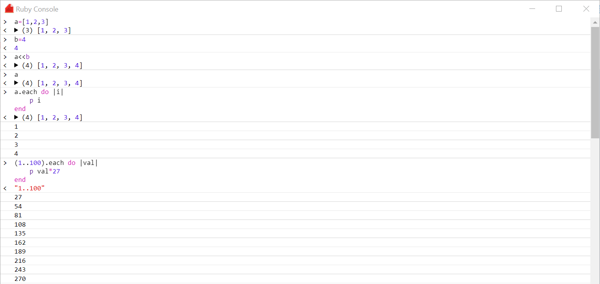

# RubyConsole

This project was initially written due to the lack of `irb` in InfoWorks ICM. However the console has now been extended to work on all operating systems using regular ruby.

This console requires Google Chrome to be installed.

This library primarily uses the ChromeConsole found here:
https://github.com/TarVK/chromeConsole
